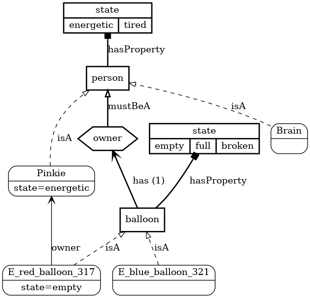

# Conditionals

If you teach me the rules, then I will know how to infer the
preconditions and results of actions. I will also have a limited
understanding of the implications of facts.

## Etiology

You can teach me cause and effect, allowing me to set the world in motion.

### Simple Reactions

```
A balloon's state must be empty, full, or broken.

A person's state must be energetic or tired.

A balloon's owner must be a person.

A balloon must have an owner.

Pinkie and Brain are persons.

There is a red balloon and a blue balloon.

Pinkie is energetic.

The red balloon is empty.

Pinkie is the red balloon's owner.
```

[](assets/etiology.png)

```
> If a person inflates a balloon, it becomes full.

OK.

> Pinkie inflates the red balloon.

OK.

> What is the red balloon's state?

Full.
```

I also understand **after**, **when** and **whenever** as conditionals describing cause and effect.

```
> After a person punctures a balloon, it becomes broken.

OK.

> When a person deflates a balloon, it becomes empty.

OK.

> Whenever a balloon bursts, it becomes broken.

OK.
```

### Multiple Reactions

A cause may have more than one effect:

```
> When a person inflates a balloon, it becomes full; also the person becomes tired.

OK.

> Pinkie inflates the red balloon.

OK.

> What is the red balloon's state?

Full.

> What is Pinkie's state?

Tired.
```

### Chain Reactions

Effects may themselves be causes, resulting in a cascade of further effects.

```
> A balloon's neighbor must be a balloon.

OK.

> When a person punctures a balloon, it pops.

OK.

> When a balloon pops, it becomes broken; also its neighbor pops.

OK.

> The blue balloon is the red balloon's neighbor.

OK.

> The red balloon and the blue balloon are full.

OK.

> Pinkie punctures the red balloon.

OK.

> Is the red balloon broken?

Yes.

> Is the blue balloon broken?

Yes.
```

### Causes

I can recognize either actions or changes as causes:

```
> When a balloon becomes full, its owner becomes tired.

OK.

> When a person inflates a balloon, the person becomes energetic.

OK.

> When a balloon pops, its owner becomes tired.

OK.
```

But I do not recognize static conditions as causes.

```
> When a balloon is full, its owner becomes tired.

I am unable to validate the belief that when a balloon is full, then its owner becomes tired.
```

Instead, you can either restate it as a change in state ("the balloon becomes full"),
or you can use the **consequently** modifier:

```
> If a balloon is full, consequently its owner is tired.

OK.
```

When declared as above, the consequence must continue to hold for as
long as the antecedent does.  (FIXME: this constraint is not actually
implemented yet!)

### Effects

Likewise, I expect effects to be either actions or state changes:

```
> When a balloon becomes full, Pinkie pops it.

OK.

> Whenever a balloon becomes full, its owner becomes tired.

OK.
```

I only understand static conditions as effects when you add the
**subsequently** modifier, or when you use the **after** conditional:

```
> When a balloon becomes full, then its owner is tired.

I am unable to validate the belief that when a balloon becomes full, then its owner is tired.

> After a balloon becomes full, its owner is tired.

OK.

> When a balloon becomes full, its owner is subsequently tired.

OK.
```

### Conjunctive Conditions

In order to limit the situations in which a cause results in an effect, you can specify an additional condition:

```
> If a person inflates a balloon, and the person is tired, then the balloon becomes full.

OK.

> If a person inflates a balloon, and the person is energetic, then the balloon becomes broken.

OK.

> The red balloon is empty.

OK.

> Brain is tired.

OK.

> Pinkie is energetic.

OK.

> Brain inflates the red balloon.

OK.

> What is the red balloon's state?

Full.

> Pinkie inflates the red balloon.

OK.

> What is the red balloon's state?

Broken.
```

I can only handle one extra condition like this, and it must be combined with the cause via **AND** (not **OR**).

### Preconditions

You can tell me to enforce a certain condition before an event can take place:

```
> If a person inflates a balloon, it becomes full.

OK.

> If a person punctures a balloon, it pops.

OK.

> Before a balloon pops, it must be full.

OK.

> Pinkie punctures the red balloon.

But the red balloon is not full.

> Pinkie inflates the red balloon.

OK.

> Pinkie punctures the red balloon.

OK.
```

## Variables

When a rule refers to a variable, its form is important:

```
> A cloudbuster is a kind of balloon.

OK.

> After a person hugs a cloudbuster, the person becomes energetic.

OK.

> Pinkie hugs the red balloon.

I'm not sure how to interpret that.
```

Since hugging is only defined specifically for cloudbusters, I'm not sure
what it means to hug the generic red balloon.

### Disambiguation

You can refer to two different variables having the same form:

```
> When a balloon refills another balloon, the balloon becomes empty; also the other balloon becomes full.

OK.

> The red balloon refills the blue balloon.

OK.

> What is the red balloon's state?

Empty.

> What is the blue balloon's state?

Full.
```

Alternatively, you can use ordinal references:

```
> When a first balloon refills a second balloon, the first balloon becomes empty; also the second balloon becomes full.

OK.
```

Or be high-falutin:

```
> When a balloon refills another balloon, the former becomes empty; also the latter becomes full.

OK.
```

Or use named references:

```
> When a balloon (the filler) refills another balloon (the fillee), the filler becomes empty; also the fillee becomes full.

OK.
```

### Plurals

You can use plurals when referring to variables:

```
> When a person inflates any balloons, they become full.

OK.

> Pinkie inflates the red balloon and the blue balloon.

OK.

> Are all balloons full?

Yes.
```

But the plurality doesn't have any special meaning; it still applies even
when only a single object is involved:

```
> When a person inflates some balloons, they become full.

OK.

> Pinkie inflates the blue balloon.

OK.

> What is the blue balloon's state?

Full.
```

Likewise, a non-plural variable still applies when multiple objects are involved:

```
> When a person inflates a balloon, it becomes full.

OK.

> Pinkie inflates the red balloon and the blue balloon.

OK.

> Are all balloons full?

Yes.
```

## Equivalences

You can teach me how to interchange equivalent conditions.

```
> If a person holds a balloon, equivalently the person is its owner.

OK.

> Who holds the red balloon?

Pinkie.

> Brain holds the blue balloon.

OK.

> Who is the blue balloon's owner?

Brain.
```

The equivalent conditions must be either states or relationships, not changes or actions:

```
> If a person holds a balloon, equivalently the person becomes its owner.

I am unable to validate the belief that if a person holds a balloon, equivalently the person becomes its owner.
```

(FIXME:  I don't actually know how to discriminate stative from action verbs yet)
