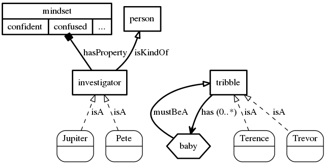

# Exceptions

```
An investigator is a kind of person.
An investigator's mindset may be confident or confused.
Jupiter and Pete are investigators.
A tribble's baby must be a tribble.
After a tribble eats,
 it has a baby;
 also its baby eats.
Terence is a tribble.
Trevor is a tribble.
```

[](assets/exceptions.png)

## FailedParse

```
> orange the soccer field

Sorry, I cannot understand what you said.
```

## UnknownForm

```
> is there a jubjub

Sorry, I don't know about any 'jubjub'.
```

## UnknownState

```
> is Jupiter arrogant?

Sorry, I don't know what 'arrogant' means for Jupiter.
```

## NonExistent

```
> is the mysterious investigator confused

But I don't know about any such investigator.
```

## NotUnique

```
> is the investigator confused

Please be more specific about which investigator you mean.
```

## UnresolvedPronoun

```
> who is he

Sorry, when you say 'he' I don't know who or what you mean.
```

## AmbiguousPronoun

```
> are Terence and Trevor its baby

Sorry, when you say 'its', it's ambiguous.
```

## MisqualifiedNoun

```
> After a tribble eats, the second tribble is sad.

Sorry, when you say 'second tribble', I don't know which you mean.
```

## TriggerLimit

```
> Terence eats.

Trigger limit exceeded.
```

## IncomprehensibleBelief

FIXME

## InvalidBelief

```
> if an investigator fires a gun, then it is broken

I am unable to validate the belief that if an investigator fires a gun, then it is broken.
```

## BeliefNotYetImplemented

```
> a green door must be either open or closed

I am not yet capable of processing the belief that a green door must be either open or closed.
```

## ReferenceNotYetImplemented

```
> Pete is a house's owner

I am unable to understand the belief that Pete is a house's owner.
```

## NewBeliefsProhibited

```
> A tribble is a kind of reptile

The belief that a tribble is a kind of reptile is prohibited in the given context.
```

## ImplicitIdealsProhibited

```
> an ewok is a kind of animal

The belief that an ewok is a kind of animal is prohibited in the given context.
```

## ImplicitPropertiesProhibited

```
> Trevor is hungry

The belief that Trevor is hungry is prohibited in the given context.
```

## TentativeIdealsProhibited

```
> Bob exists

The belief that Bob exists is prohibited in the given context.
```

## TentativeEntitiesProhibited

```
> Jupiter has an uncle

The belief that Jupiter has an uncle is prohibited in the given context.
```

## AmbiguousInterpretation

```
> there is a big door

OK.

> there is a door

Previously I was told that a big door exists.  So there is an ambiguous reference in the belief that there is a door.
```

## CardinalityConstraint

```
> A bloodhound's owner must be an investigator

OK.

> A bloodhound must have an owner

OK.

> McGruff is a bloodhound

OK.

> Pete is McGruff's owner

OK.

> Jupiter is McGruff's owner

Previously I was told that a bloodhound must have one owner and Pete is McGruff's owner.  So it does not add up when I hear that Jupiter is McGruff's owner.
```

## TaxonomyCycle

```
> a hamster is a kind of tribble

OK.

> a tribble is a kind of hamster

The belief that a tribble is a kind of hamster contradicts the belief that a hamster is a kind of a tribble.
```

## OverlappingProperties

```
> a tribble may be round or square

OK.

> a tribble may be red or blue

OK.

> a tribble may be round or red

I am not yet capable of processing the belief that a tribble may be round or red.
```

## PropertyAlreadyClosed

```
> a portal must be open or closed

OK.

> a door is a kind of portal

OK.

> a door may be open or ajar

The belief that a door may be open or ajar contradicts the belief that a door must be open or closed.
```

## RoleHypernymNonExistent

```
> a tribble's owner is a kind of guardian

I am unable to understand the belief that a tribble's owner is a kind of guardian.
```

## RoleHyponymConflictsWithForm

```
> a tribble's guardian must be a person

OK.

> an owner is a kind of person

OK.

> a tribble's owner is a kind of guardian

I am unable to understand the belief that a tribble's owner is a kind of guardian.
```

## RoleHyponymAlreadyExists

```
> a tribble may have a guardian

OK.

> a tribble may have a petsitter

OK.

> a tribble's owner is a kind of guardian

OK.

> a tribble's owner is a kind of petsitter

I am unable to understand the belief that a tribble's owner is a kind of petsitter.
```

## RoleTaxonomyIncompatible

```
> a groomer is a kind of caretaker

OK.

> Kirk is a groomer

OK.

> a tribble's custodian must be a caretaker

OK.

> Kirk is Terence's custodian

OK.

> a tribble's custodian must be a chef

The belief that a tribble's custodian must be a chef contradicts the belief that Kirk is a groomer and Kirk is Terence's custodian.
```

## FormTaxonomyIncompatible

```
> Pete is a monster

The belief that Pete is a monster contradicts the belief that Pete is an investigator.
```

## FormRoleIncompatible

```
> a tribble's groomer must be a human

OK.

> a tribble must have a groomer

OK.

> Spock is a Vulcan

OK.

> Spock is Terence's groomer

The belief that Spock is Terence's groomer contradicts the belief that a tribble's groomer must be a human.
```

## PropertyDomainIncompatible

```
> a door's state may be either open or closed

OK.

> a door's state must be an spc-string

The belief that a door's state must be an spc-string contradicts the belief that a door's state may be open or closed.
```

## AbsenceConstraint

```
> McGruff is Jupiter's pet

OK.

> Jupiter has no pets

The belief that Jupiter has no pets contradicts the belief that McGruff is Jupiter's pet.
```

## AssertionModifiersIncompatible

* BEFORE+SUBSEQUENTLY
* CONSEQUENTLY+SUBSEQUENTLY
* OTHERWISE+ALSO
* OTHERWISE+EQUIVALENTLY
* ALSO+EQUIVALENTLY
* ALSO on "x can do y"

```
> If a tribble eats, equivalently it is subsequently fat.

I am unable to validate the belief that if a tribble eats, equivalently it is fat subsequently.
```

## AssertionModifierSequence

* OTHERWISE/ALSO prohibited on main consequent
* OTHERWISE must be last
* only one OTHERWISE allowed
* OTHERWISE/ALSO required on subsequent consequents

```
> After a tribble eats, also it becomes fat.

I am unable to validate the belief that after a tribble eats, then it becomes fat also.
```

## QuantifierNotYetImplemented

```
> After a tribble eats, some tribble becomes fat.

I am unable to validate the belief that after a tribble eats, then some tribble becomes fat.
```

## PostConstraintNotYetImplemented

```
> After a tribble eats, it must be alone.

I am unable to validate the belief that after a tribble eats, then it must be alone.
```

## AntecedentEventExpected

* not equivalently/consequently

```
> After a tribble is happy, it eats.

I am unable to validate the belief that after a tribble is happy, then it eats.
```

## ConsequentConditionExpected

equivalence plus

* become
* action verb
* subsequently or consequently

```
> If a tribble eats, equivalently it becomes happy.

I am unable to validate the belief that if a tribble eats, equivalently it becomes happy.
```

## ConsequentEventExpected

antecedent event plus
* stative without subsequently/consequently/equivalently

```
> When a tribble eats, it is happy.

I am unable to validate the belief that when a tribble eats, then it is happy.
```

## ConsequentConstraintExpected

* BEFORE/OTHERWISE

```
> Before a tribble eats, it is happy.

I am unable to validate the belief that before a tribble eats, then it is happy.
```

## AssertionInvalidVariable

```
> If a tribble is a tribble's baby, then the tribble eats.

I am unable to validate the belief that if a tribble is a tribble's baby, then the tribble eats.
```

## AssertionInvalidAssociation

```
> If a tribble is another tribble's baby, then the tribble's parent is the tribble.

I am unable to validate the belief that if a tribble is another tribble's baby, then the tribble's parent is the tribble.
```

## EquivalenceIfExpected

```
> After a tribble eats, equivalently it is happy.

I am unable to validate the belief that after a tribble eats, equivalently it is happy.
```

## AssertionModalProhibited

* EQUIVALENTLY
* ALSO

```
> If a tribble eats, equivalently it must be happy.

I am unable to validate the belief that if a tribble eats, equivalently it must be happy.
```

