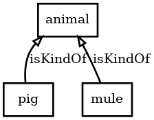
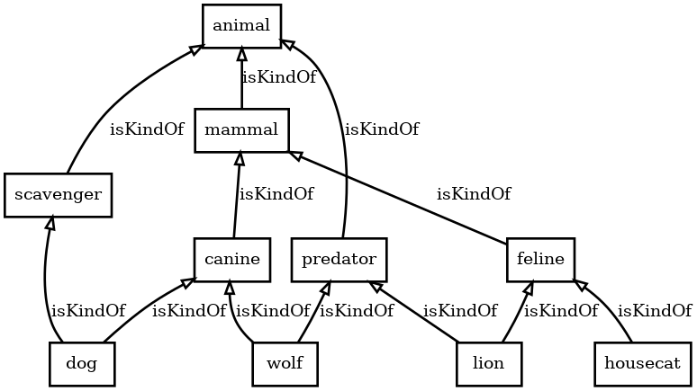
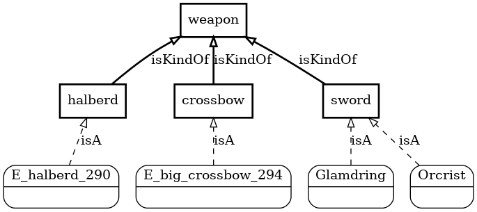
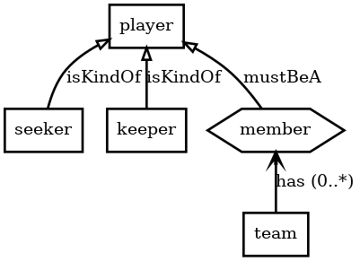
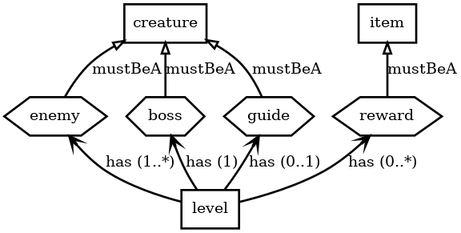
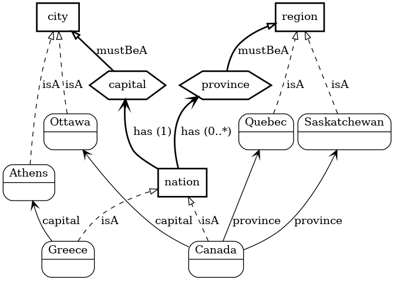
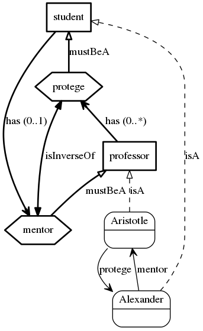
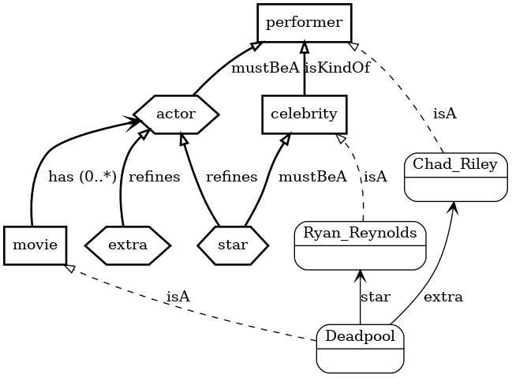
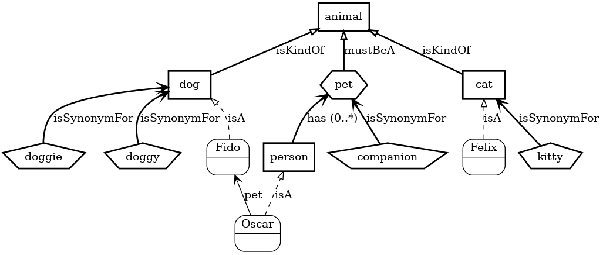
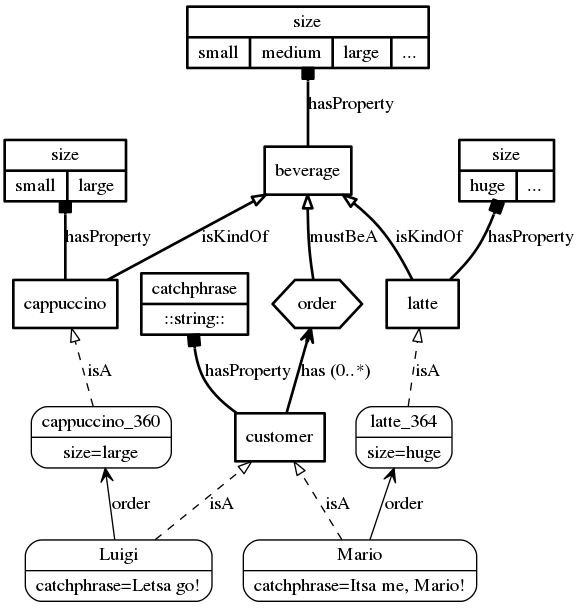

# Ontology

I am eager to find out what kinds of things may exist, and how they are
related, and their attributes.

## Taxonomy

You can tell me how things are classified.  Loosely, I follow
[Plato](https://en.wikipedia.org/wiki/Theory_of_forms), so I see the
ideal forms existing in their own plane.  I can display them like
this:

```
A pig is a kind of animal.
A mule is a kind of animal.
```

[](assets/taxonomy.png)
The structure may be a vast web rather than a simple tree:

```
A mammal is a kind of animal.
A canine or a feline is a kind of mammal.
Predators and scavengers are kinds of animal.
Dogs and wolves are kinds of canine.
A housecat or a lion is a kind of feline.
A wolf or a lion is a kind of predator, and a dog is a kind of scavenger.
```

[](assets/hypernyms.png)
As seen above with "a canine or a feline", you can combine your
assertions using conjunctions in cases where it makes sense.  And you
can use equivalent phrasing, so I would understand "canines and
felines are kinds of mammals" as well.  However, I will reject nonsensical
or ambiguous phrasing (e.g. "a canine and a feline is a kind of
animal").  I may also reject phrasing that is too complicated for
me to understand, in which case you can try breaking it down into
multiple simpler thoughts.


## Form Instantiation

You can tell me about particular instances of forms, either named or anonymous:

```
Swords, halberds, and crossbows are kinds of weapon.
Glamdring and Orcrist are swords.
There is a halberd.
A big crossbow exists.
```

[](assets/formInstantiation.png)
Anonymous instances may be qualified (like the big crossbow), but I'm
not yet capable of understanding named objects which are qualified
(e.g. ```Orcrist is an elvish sword```).

Now I can answer questions about what exists:

```
> what weapons exist

Glamdring, Orcrist, a halberd, and a big crossbow.

> how many swords are there

Two of them.

> is Orcrist a crossbow

No.

> what is Glamdring

A sword.
```

## Associations

You can instruct me on how things may be associated.  And then I can display
those associations like this:

```
A team's member must be a player.
Seekers and keepers are kinds of player.
```

[](assets/assoc.png)
(Notice that I use different arrow styles to distinguish taxonomy from
association.  Also, I use different shapes to distinguish forms from the
roles they play.)

You can tell me which associations are optional, and which are
mandatory.  You can also constrain their multiplicity.

```
A level's enemy must be a creature.
A level's boss must be a creature.
A level's guide must be a creature.
A level's reward must be an item.
A level must have enemies and a level must have a boss.
A level may have rewards and a level may have a guide.
```

[](assets/constraints.png)
### Association Instantiation

You can connect particular instances of forms via their associations:

```
A nation's capital must be a city.
A nation's province must be a region.
A nation may have provinces.
A nation must have a capital.
Canada and Greece are nations.
Ottawa and Athens are cities.
Quebec and Saskatchewan are regions.
Ottawa is Canada's capital.
Athens is Greece's capital.
Quebec is Canada's province.
Saskatchewan is Canada's province.
```

[](assets/assocInstantiation.png)
Now I can answer questions about how things are connected:

```
> what is Canada's capital

Ottawa.

> is Ottawa Greece's capital

No.

> which regions are Canada's provinces

Quebec and Saskatchewan.

> what is Athens

Greece's capital.

> what is Greece

A nation.
```

### Inverses

You can tell me that one association is the inverse of another:

```
A student's mentor must be a professor.
A professor's protege must be a student.
A student may have a mentor.
A professor may have proteges.
If a professor is a student's mentor, then equivalently
 the student is the professor's protege.
Aristotle is a professor and Alexander is a student.
Aristotle is Alexander's mentor.
```

[](assets/inverses.png)
After learning that Aristotle is Alexander's mentor, I am able to
infer automatically that Alexander is Aristotle's protege.

### Refinements

You can tell me how associations may be refined.  For example,
motherhood is a refinement of being a parent.  Here's a complete example:

```
A celebrity is a kind of performer.
A movie's actor must be a performer.
A movie's star is a kind of actor.
A movie's star must be a celebrity.
A movie's extra is a kind of actor.
Deadpool is a movie.
Ryan Reynolds is a celebrity and Chad Riley is a performer.
Ryan Reynolds is Deadpool's star and Chad Riley is Deadpool's extra.
```

[](assets/refinement.png)
Now I know how to group together actors generically, or discriminate
them as stars or extras:

```
> who are Deadpool's actors

Ryan Reynolds and Chad Riley.

> who are Deadpool's stars

Ryan Reynolds.

> who are Deadpool's extras

Chad Riley.
```
## Scoping

I can distinguish the same role name used in different association contexts:

```
A sailor is a kind of person.
A ship's mate must be a sailor.
A person's mate must be a person.
If a person's mate is another person, then equivalently
 the first person is the second person's mate.
Gilligan is a sailor and Minnow is a ship.
Gilligan is Minnow's mate.
Adam and Eve are persons and Adam is Eve's mate.
```

[](assets/scoping.png)
## Synonyms

You can tell me alternate names for things:

```
Dogs and cats are kinds of animal.
A person's pet must be an animal.
A person's companion is the same as a pet.
A doggie or a doggy is the same as a dog.
A kitty is the same as a cat.
Fido is a doggie, Felix is a cat, and Oscar is a person.
Fido is Oscar's pet.
```

[](assets/synonyms.png)
Then you can use them interchangeably:

```
> Is Fido a dog?

Yes.

> Which kitties exist?

Felix.

> What is Oscar's companion?

Fido.
```
## Properties

You can tell me about the properties of objects:

```
A beverage's size may be small, medium, or large.
A customer's order must be a beverage.
A customer's catchphrase must be an spc-string.

A cappuccino or a latte is a kind of beverage.
A cappuccino's size must be small or large.
A latte's size may be huge.

There is a cappuccino and a latte.

Luigi and Mario are customers.
Luigi's catchphrase is "Letsa go!" and Mario's catchphrase is "Itsa me, Mario!"

The cappuccino is Luigi's order.
The cappuccino is large.

The latte is Mario's order.
The latte is huge.
```

[](assets/properties.png)
Then I can answer questions about them:

```
> What is Luigi's order's size?

Large.

> Is the cappuccino small?

No.

> The cappuccino is medium.

The belief that the cappuccino is medium contradicts the belief that a cappuccino's size must be small or large.

> What is the latte's size?

Huge.

> What is Mario's catchphrase?

"Itsa me, Mario!".
```
## WordNet Ontology

In some environments, I automatically have access to builtin ontology
information from WordNet.  For example, in WordNet, "duchess" is
defined as a *hyponym* of "noblewoman".  So:

```
> Wilhelmina is a duchess.

OK.

> Is Wilhelmina a noblewoman?

Yes.

> Is Wilhelmina a princess?

No.
```
You can extend the WordNet ontology directly:

```
> A landspeeder is a kind of hovercraft.

OK.

> There is a landspeeder.

OK.

> Which vehicles exist?

A landspeeder.
```
I am able to figure out that the landspeeder is a vehicle, because
in WordNet, "vehicle" is a hypernym of "hovercraft".
