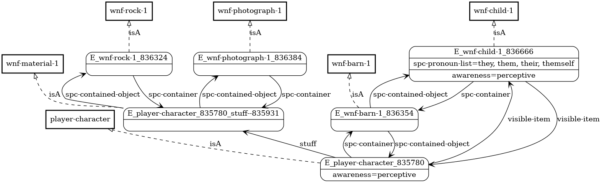
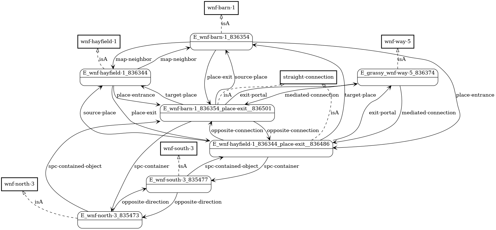

# Phlebotinum

Phlebotinum is an interactive fiction system based on [SHLURD](readme.md).

It is similar to [Inform 7](http://inform7.com) in that a limited form of
natural language is used for authoring stories.  It is different in
that the same natural language is used while interpreting stories as
well.

## A Rather Short Story

* [play here](http://phlebotinum.xyz:8000)
* if you get stuck, there's a [walkthrough](walkthrough.md)
* [see source code](https://github.com/lingeringsocket/hello-phlebotinum) (but hey, make sure you try playing it first!)

## Story Organization

A story is created as a collection of files:

* [Base axioms](https://github.com/lingeringsocket/hello-phlebotinum/blob/master/base-axioms.txt) define the [ontology](ontology.md) of the game world.  This is the shared base of reality for all characters in the game.  The corresponding file **must** be named ```base-axioms.txt```.  Base axioms must also include the existence of the characters (not to get all theological, but these "souls" need to be granted their existence before their private mental worlds can come into being).
* [Game initialization](https://github.com/lingeringsocket/hello-phlebotinum/blob/master/game-init.txt) is the *fiat lux* which populates the world and situates the characters which inhabit it.  The corresponding file **must** be named ```game-init.txt```.  Game initialization also sets up the world's [behavior](conditionals.md), as seen in the [behavior axioms](https://github.com/lingeringsocket/hello-phlebotinum/blob/master/behavior-axioms.txt) from the example story.
* [Capability axioms](https://github.com/lingeringsocket/hello-phlebotinum/blob/master/capability-axioms.txt) define the actions understood by the interpreter in terms of [capabilities](capabilities.md)
* [Character mind initialization](https://github.com/lingeringsocket/hello-phlebotinum/blob/master/player-mind-init.txt) is used to bring the private mental world of the player character to life (and possibly that of non-player characters as well, such as [the child](https://github.com/lingeringsocket/hello-phlebotinum/blob/master/child-mind-init.txt) from the example story).  At a minimum, in good self-help fashion, the player needs to believe in some capabilities, otherwise all actions will be prohibited.

A file may include the beliefs from other files via the **Believe** directive:

```
Believe "/phlebotinum/default-capability-axioms.txt".
Believe "/base-axioms.txt".

A person can climb a tree.
...
```

In the example above, the first **Believe** directive includes all the
[default capability axioms from the phlebotinum library](https://github.com/lingeringsocket/shlurd/tree/master/cli/src/main/resources/phlebotinum/default-capability-axioms.txt), whereas the second
directive includes the ontology axioms from the story currently being defined.

Redundant belief inclusions are automatically ignored.

A story can be broken up into as many files as desired, either for
reuse or for organizational clarity.  In the example, [behavior axioms](https://github.com/lingeringsocket/hello-phlebotinum/blob/master/behavior-axioms.txt) include a separate file defining the [axioms regarding what happens when the player tries to love something](https://github.com/lingeringsocket/hello-phlebotinum/blob/master/love-behavior-axioms.txt).

## Minds, Worlds, and Perception

The objective reality of the game is the *noumenal* world.

Each game character may have a mind with an associated *phenomenal*
world (what the character is aware of).  A phenomenal world may be:

* a simple subset of the noumenal world (based on what the character has encountered so far)
* a subset of the noumenal world, plus an imagined superset (private beliefs, hallucinations, etc)
* a totally private world independent of the noumenal world

When a character encounters an object in the noumenal world, the
object becomes a *perceived* part of the character's phenomenal world.
So at any time, an object may have one of the following states with
respect to a character's mind:

* *unknown* (the character has not encountered it yet, or it has been
  completely removed from the character's awareness)
* *fresh* (the character is currently perceiving it for the first time)
* *familiar* (the character is currently perceiving it, but was already aware of it)
* *stale* (the character has encountered it, but is not currently perceiving it)

## Game Turns

Each input sentence entered by the player corresponds to one *game turn*.  A
game turn proceeds roughly as follows:

1. New game turn starts
2. All previously perceived objects become stale for all characters
3. For each character, all objects currently in scope (based on the character's location, possessions, and sensory awareness) become either fresh (if encountered for the first time) or familiar (if previously encountered)
4. The sentence is interpreted with respect to the player character's phenomenal world (including the player's capabilities)
5. If any interpretation errors are encountered, the game turn ends with a failure message; otherwise, if the sentence is a statement or question, it is evaluated and an appropriate response is reported
6. If the sentence is a command, it is re-processed with respect to the noumenal world; this may lead to errors based on failed preconditions or other constraints; it may also lead to triggered actions (which may themselves trigger errors or other actions recursively)
7. If any errors were encountered during processing, the effects of all triggered actions are ignored, and the game turn ends with a failure message
8. Otherwise, the noumenal world state is updated, the game turn ends successfully, and all perceptible action effects are reported

## Containment and Possession

The containment model is currently very basic: objects can contain
other objects recursively, but there is not yet any notion of
supporter, transparency, etc.  Locations are objects, and they contain
whatever is present in them (including characters).

Each character has an associated inventory, a.k.a. stuff
(which is itself a kind of object so that it can contain other
things).  So if a character is holding a lantern, the lantern is not
directly inside of the character (ouch!); instead, it is in the character's
stuff.  Getting an object moves it from a location to the character's
stuff, and the opposite is true for dropping an object.

In the example story, here's how this looks after getting the rock and
moving to the barn:

[](assets/possessions.png)


## Maps

The game axiom library supplies a fairly standard map representation:

* the eight compass directions (N/S/E/W/NW/SW/NE/SE) plus the two vertical directions (zenith and nadir) are singleton map-direction objects (e.g. "the north"), each of which has an opposite direction
* locations are represented by map-places
* map-places are linked by one-directional map-connections, each of which has a source-place and a target-place; conversely, map-places have map-connections as their place-exits and place-entrances
* a standard straight-connection type is defined (e.g. a passage from east to west), but custom types (e.g. elbow-shaped passages) can be defined as well
* since most passages between places are bidirectional, a map-connection is typically associated with an opposite-connection
* map-portals (including doors, passages, etc) are objects which mediate map-connections; for a bidirectional passage, typically the same map-portal object is associated with the two opposing map-connections

Let's take a look at the pathway from the meadow to the barn in the example story:

[](assets/grassy.png)

Whew!  There's a lot going on here:

* The actual map locations are the meadow (aka "hayfield") and the barn
* The map connections are the place exits.
* The singleton compass directions (north and south) are the containers for the place exits, indicating the direction in which an exit leads
* Finally the grassy path object (aka "grassy way") is the portal which mediates these connections.

## Movement

* for direction-based movement (e.g. ```go north```), the current location must have a place-exit in the corresponding direction
* for location-based movement (e.g. ```go to the kitchen```), the destination must be a known neighbor of the current location
* for object-based movement (e.g. ```enter the oven```), the destination object must not be stale (and must in fact be a location)
* for any type of movement, if there is a door or other portal mediating the map-connection, the portal must be open

## And More

* the player character
* non-player characters
* the interpreter
* actions
* capabilities
* otherwise/complains

## Command Interpretation

## Conversations

A conversations with an NPC may be modeless:

```
> s

OK.

You are in a barn.

You see a child.

You see the grassy path to the north.

> ask the child "who am I"

OK.

They respond, "You are some oldster."

> say "follow me" to the child

OK.

They respond, "No."

> tell the child "I am your father"

OK.

They respond, "Oh, really?"
```

(Inform-style direct address appositions such as "child, follow me" are not yet supported.)

Alternatively, a conversation may be modal:

```
> s

OK.

You are in a barn.

You see a child.

You see the grassy path to the north.

> talk to the child

OK.

(You are now in conversation.  Say TTYL to stop.)

> where is my wife

"I don't know."

> what is in the barn

"I and some oldster are in it."

> I have some candy

"Oh, really?"

> take this photo

"No."

> TTYL

(You are no longer in conversation.)

> l

OK.

You are in the barn.

You see the child.

You see the grassy path to the north.
```

Normally, the player is "talking" to the game interpreter, but for the
duration of a modal conversation, utterances are directed at an NPC
instead.

When processing sentences, NPC's evaluate them with respect to their
own minds.  Typically, an NPC's private world will not match that of
either the player or the game interpreter, so their responses will
vary accordingly.

NPC's respond to questions, but beyond that, responses are quite limited:

* statements are confirmed if true; false or unverifiable statements are met with skepticism
* statements never result in the NPC's mental state being changed
* all commands are curtly rejected

## Wordnet Ontology

