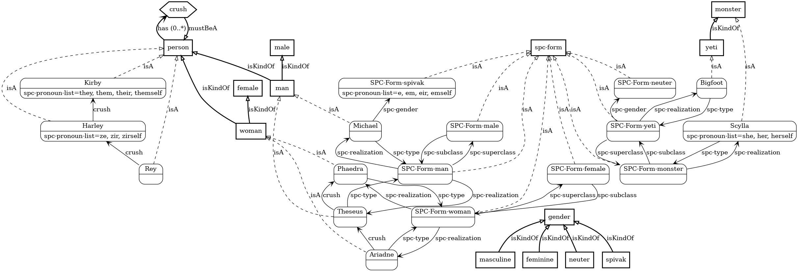

# Gender and Pronouns

You can teach me about diversity:

```
// These beliefs are automatic from WordNet, and are only
// included here for completeness:
A man or a woman is a kind of person.
A man is a kind of male.
A woman is a kind of female.
A yeti is a kind of monster.
Masculine, Feminine, and Neuter are kinds of gender.
// Sex+gender have default pairings, but these can be overridden
// for individuals or entire subclasses.  Here we pair
// the biological form Male with the gender form Masculine,
// and likewise Female with Feminine.
Masculine is Male's gender.
Feminine is Female's gender.

// Remaining beliefs below are custom

// Allow a monster to be the answer to "who is..." questions
A monster is a kind of spc-someone.

// Introduce a custom gender, with associated pronouns
Spivak is a kind of gender.
"E" is a nominative pronoun.
"Em" is an objective pronoun.
"Eir" is a possessive pronoun.
"Emself" is a reflexive pronoun.
Spivak's spc-pronoun-list is "e, em, eir, emself".

// Pair the biological form Yeti with the gender form Neuter
Neuter is Yeti's gender.

A person's crush must be a person.
Michael and Theseus are men.
Ariadne and Phaedra are women.
Theseus is Ariadne's crush.
Phaedra is Theseus' crush.
Kirby, Harley and Rey are persons.
Harley is Rey's crush.
Harley's crush is Kirby.
Bigfoot is a yeti.
Scylla is a monster.

// Specify "singular they" pronouns for one individual person
Kirby's spc-pronoun-list is "they, them, their, themself".

// Specify custom pronouns for another individual
"Ze" is a nominative pronoun.
"Zir" must be an objective pronoun or a possessive pronoun.
"Zirself" is a reflexive pronoun.
Harley's spc-pronoun-list is "ze, zir, zirself".

// Even though Scylla is a monster, and hence having no gender
// at all, we can still specify whatever pronouns we want,
// overriding the defaults taken from the gender (if any).  Note that
// even with these custom pronouns defined, Scylla still has no gender.
Scylla's spc-pronoun-list is "she, her, herself".

// Likewise, we can override the gender of one man in particular
Michael's gender is Spivak.
```

[](assets/pronouns.png)

I have intrinsic knowledge of the pronouns for masculine, feminine, and neuter genders:

```
> Is Ariadne a woman?

Yes, she is a woman.

> Who is her crush?

Her crush is Theseus.

> Who is his crush?

His crush is Phaedra.

> What is Bigfoot?

It is a yeti.
```

And if you teach me custom pronouns for anyone or anything, I will use them:

```
> Who is Harley?

Ze is Rey's crush.

> Who is zir crush?

Zir crush is Kirby.

> Whose crush is Kirby?

They are Harley's crush.

> What is Scylla?

She is a monster.
```

I can also infer pronouns from gender:

```
> Who is Michael?

E is a man.
```

Note that even though in general a man has been defined as having
masculine gender (implying associated masculine pronouns),
Michael's gender has been explicitly set to Spivak, so I use
the corresponding pronouns to refer to em.

Finally, when someone has no custom pronouns declared, I will avoid pronouns
altogether when referring to that individual:

```
> Who is Rey's crush?

Rey's crush is Harley.
```

