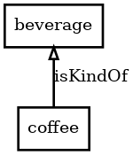

# Words

When I parse an English sentence, by default I look up words using
[wordnet 3.1](http://wordnetweb.princeton.edu/perl/webwn), and then
try to determine the correct part of speech for each word based on both
syntax and semantics.

```
A coffee is a kind of beverage.
```

[](assets/words.png)

For unknown uncapitalized words, I usually assume them to be common nouns,
which may cause confusion:

```
> A coffee's size may be small, medium, or ginormous.

Modals not supported yet.
```

To correct this, you can teach me new words:

```
> "ginormous" is an adjective.

OK.

> A coffee's size may be small, medium, or ginormous.

OK.
```

You can also extend words I already know with additional usages.  For
example, from Wordnet, I know the word "rad" as a noun (a unit of
absorbed ionizing radiation).  You can extend it to be usable as an
adjective as well:

```
> "rad" may be an adjective.

OK.

> A surfer or a miner is a kind of person.

OK.

> A surfer's accent may be rad, tubular, or gnarly.

OK.

> A rad is a kind of unit.

OK.

> If a miner absorbs a rad, the miner dies.

OK.
```

Or you can tell me to forget about pre-existing usages:

```
> "rad" must be an adjective or an adverb.

OK.

> A rad is a kind of unit.

Sorry, I cannot understand what you said.
```

## Parts of Speech

These are the English parts of speech you can specify when you define a word:

* noun (assumed singular+common)
* common noun (assumed singular)
* proper noun (assumed singular)
* plural noun (assumed common)
* plural proper noun
* verb
* adjective
* adverb
* [pronoun](pronouns.md) (assumed nominative)
* nominative pronoun
* objective pronoun
* reflexive pronoun
* possessive pronoun (FIXME:  discriminate her vs hers)
* conjunction
* preposition

## Compound Words

I know some compound words (with or without spaces or hyphens) from Wordnet:

```
> A big top is a kind of tent.

OK.
```

But others I need to be told about:

```
> A big bad is a kind of villain.

I'm not sure how to interpret that.
```

So:

```
> "big bad" may be a noun.

OK.

> A big bad is a kind of villain.

OK.
```

## Proper Nouns

When you try to use normal words as names, I may get confused:

```
> Grumpy is a dwarf.

Sorry, I cannot understand what you said.
```

You can help me understand what you're trying to do:

```
> "Grumpy" is a proper noun.

OK.

> Grumpy is a dwarf.

OK.
```

You may also need to do this in cases where you use a name that I haven't
heard of before.

Of course, if you tell me that something **may be** a proper noun, then I will preserve
its original meaning and try to disambiguate based on context:

```
> "Grumpy" may be a proper noun.

OK.

> Dwarves, kings, and queens are kinds of person.

OK.

> A person's enemy must be a person.

OK.

> There is a queen.

OK.

> A person's mood may be grumpy or happy.

OK.

> Grumpy is a dwarf.

OK.

> The queen's mood is grumpy.

OK.

> What is the queen's mood?

Grumpy.

> Is the queen a dwarf?

No.

> The queen's enemy is Grumpy.

OK.

> Is the queen's enemy a dwarf?

Yes.

> There is a king.

OK.

> The king has an enemy.

OK.

> The king's enemy is grumpy.

OK.

> Is the king's enemy a dwarf?

No.
```

As you can see above, this may get a bit confusing.  If you'd prefer
to completely take over the word, just tell me that it **must be** a
proper noun (or just **is** a proper noun), and I will forget about
its existing senses:

```
> "Grumpy" must be a proper noun.

OK.

> Grumpy is a dwarf.

OK.

> A person may be grumpy or happy.

Sorry, I cannot understand what you said.
```

You can also use multi-word names (as long as they are all
capitalized), and then I'll do my best to understand full or partial
references to them:

```
> Margaret Atwood is a writer.

OK.

> Is Atwood a writer?

Yes.
```

// FIXME support titles such as "Ethelred the Unready"

When names also overlap with common words, I may get confused, in which case
you can tell me which usages to support:

```
> Clever Hans is a horse.

I am unable to understand the belief that clever Hans is a horse.

> "Clever Hans" may be a proper noun.

OK.

> Clever Hans is a horse.

OK.

> Is Hans a horse?

Yes.
```

